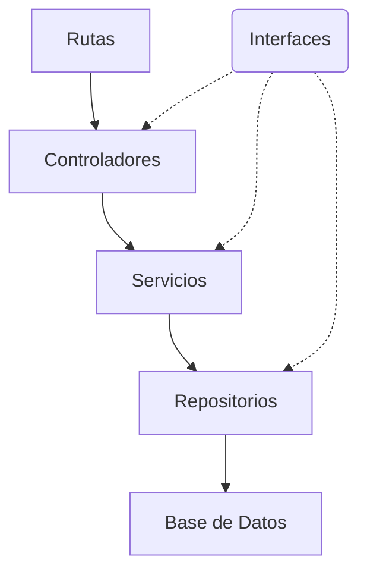
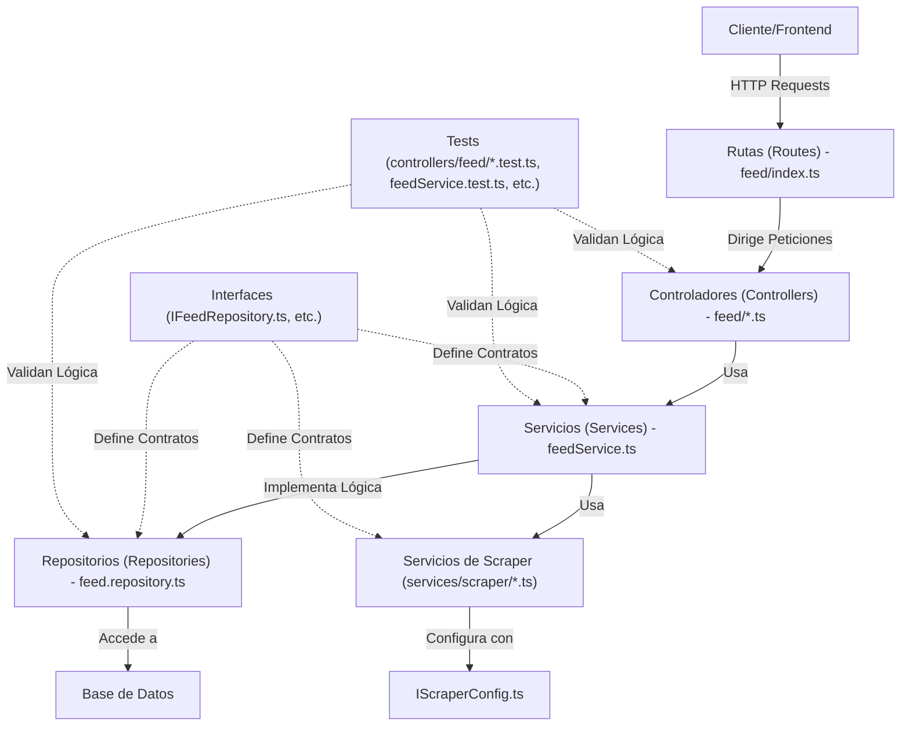

# dailytrends-api
DailyTrends es un API que expone un feed de noticias agregadas de diferentes periódicos.

## Teconologías utilizadas
- **Node.js** con **TypeScript**
- **Express.js** como framework para la API
- **MongoDB** como base de datos
- **Mongoose** como ODM para la gestión de MongoDB
- **Cheerio** para web scraping
- **Docker** para la contenerización del proyecto
- **Jest** para la ejecución de tests

## Instalación y configuración
1. Clonar el repositorio:
   ```bash
   git clone <URL_DEL_REPOSITORIO>
   cd daily-trends
   ```

2. Instalar dependencias:
   ```bash
   npm install
   ```

3. Configurar las variables de entorno:
   - Renombrar el archivo `template.env` a `.env`
   - Configurar las variables necesarias dentro de `.env`

4. Para resetear un contenedor:

   ```bash
   npm run build
   ```

5. Levantar el contenedor Docker con las imagenes de Mongo y Node:
   ```bash
   docker compose up --build -d
   ```
   `-d es para que no se queden los logs del servidor en la terminal en ejecuccóin`

6. Para resetear un contenedor al hacer un cambio:

   ```bash
   docker compose restart :container_id:
   ```


## Endpoints

### **Feeds**
- **GET** `/feeds` - Obtener todos los feeds
- **POST** `/feeds` - Crear un nuevo feed
- **GET** `/feeds/:id` - Obtener un feed específico por ID
- **PUT** `/feeds/:id` - Actualizar un feed
- **DELETE** `/feeds/:id` - Eliminar un feed

## Arquitectura
El proyecto sigue una estructura de capas para mantener el código desacoplado:



## Pruebas
Para ejecutar las pruebas:
```bash
npm test
```

## Representación de la Arquitectura


